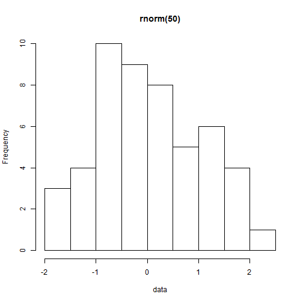

Shiny App: Distributions
========================================================
author: Pankaj Goyal
date: Sat Jul 26 19:14:10 2014
transition: rotate

Description
========================================================

This Presentation will give the idea about the shiny app "Distributions", which is basically a demostration of the five type of distributions.

- rnorm()
- runif()
- rlnorm()
- rlogis()
- rexp()

Demonstration
========================================================
Following steps will describe the working of app:

- Select any one distrubution from the list of 5 given above
- Enter the size of distribution in the num box provided (minimum value = 1, and maximum value = 1000)
- Press the apply changes button for updating the plot and data

Right side (Main Panel) consists of two tabs,one for Plot and summary of the selected distribution and another one to display the data through which plot is generated.

Contd..
========================================================
Let's suppose we selected the rnorm distribution and size = 50,
then

```r
data = rnorm(50)
summary(data)
```

```
   Min. 1st Qu.  Median    Mean 3rd Qu.    Max. 
-1.8400 -0.7290 -0.0733  0.0293  0.7600  2.0500 
```

Contd..
========================================================
Plotting the data:


```r
hist(data, main = "rnorm(50)")
```

 
